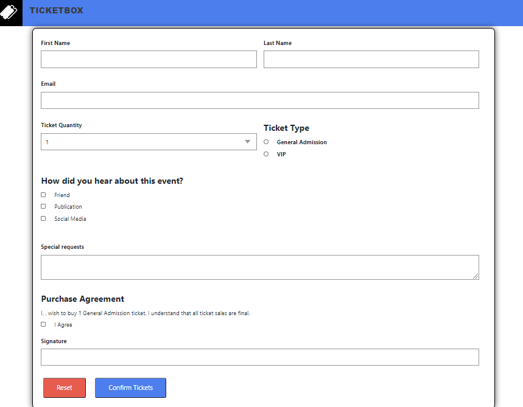

# vue-movie-ticket

## Description

This is my take on Codecademy's ticket purchase form created with Vue. Playing around with templates, directives and re-usable components.

## Technologies Utilized

Vue.js, HTML, CSS, JavaScript, Bootstrap

## Contributing

Pull requests are welcome. For major changes, please open an issue first to discuss what you would like to change.
Please make sure to update tests as appropriate.

## License

[MIT]
MIT License

Copyright (c) [2019] [alexgignilliat]

Permission is hereby granted, free of charge, to any person obtaining a copy
of this software and associated documentation files (the "Software"), to deal
in the Software without restriction, including without limitation the rights
to use, copy, modify, merge, publish, distribute, sublicense, and/or sell
copies of the Software, and to permit persons to whom the Software is
furnished to do so, subject to the following conditions:

The above copyright notice and this permission notice shall be included in all
copies or substantial portions of the Software.

THE SOFTWARE IS PROVIDED "AS IS", WITHOUT WARRANTY OF ANY KIND, EXPRESS OR
IMPLIED, INCLUDING BUT NOT LIMITED TO THE WARRANTIES OF MERCHANTABILITY,
FITNESS FOR A PARTICULAR PURPOSE AND NONINFRINGEMENT. IN NO EVENT SHALL THE
AUTHORS OR COPYRIGHT HOLDERS BE LIABLE FOR ANY CLAIM, DAMAGES OR OTHER
LIABILITY, WHETHER IN AN ACTION OF CONTRACT, TORT OR OTHERWISE, ARISING FROM,
OUT OF OR IN CONNECTION WITH THE SOFTWARE OR THE USE OR OTHER DEALINGS IN THE
SOFTWARE.

- - - - -

“Remember to look up at the stars and not down at your feet. Try to make sense of what you see and wonder about what makes the Universe exist. Be curious. And however difficult life may seem, there is always something you can do and succeed at. It matters that you don't just give up."  - Stephen Hawking